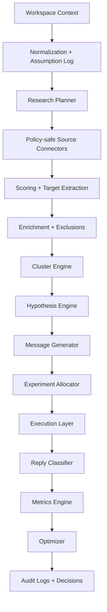

# Architecture

## Overview

The system is organized as a modular backend with a small ASGI API surface and a workflow engine that can run the full GTM loop without waiting for human input.

## Major components

### API layer

- Built with Starlette for portability in the current environment
- Exposes workspace, orchestration, and workflow-inspection routes
- Keeps request handling thin and pushes domain work into services

### Domain services

- `context.py`: normalization, inference, missing-field detection
- `research.py`: connector abstraction, query planning, item scoring
- `signal_inbox.py`: real URL, CSV, and visible-capture ingestion into the research store
- `targeting.py`: candidate extraction, enrichment, exclusions, clustering, hypotheses
- `messaging.py`: initial variants, follow-ups, balanced assignment
- `execution.py`: provider abstraction and policy-safe send preparation
- `linkedin_agent.py`: Playwright command planning for LinkedIn-assisted browser flows
- `browser_executor.py`: safe execution of Playwright open/snapshot plans with blocked final-send actions
- `llm.py`: real OpenAI Responses API integration with graceful fallback
- `replies.py`: rule-based reply classification
- `analytics.py`: metric summaries and variant lift
- `optimization.py`: strategy updates and replacement recommendations

### Orchestration

`WorkflowEngine` runs a resumable stage sequence:

1. collect or refresh context
2. create research plan
3. fetch research items
4. score items
5. extract targets
6. enrich targets
7. generate hypotheses
8. allocate experiments
9. generate messages
10. execute outbound
11. ingest responses
12. compute metrics
13. optimize strategy

## Data model strategy

The MVP uses a relational core with JSON payload columns where flexibility matters:

- relational IDs for workflows, candidates, hypotheses, actions, and metrics
- JSON columns for context, evidence, explanations, and recommendation payloads
- `create_all()` for hackathon speed, with a starter SQL migration committed for follow-up hardening

## Long-running autonomy design

- Context inference reduces operator blocking
- Signal Inbox data is used when available, and mock research connectors keep the full loop executable offline otherwise
- Outbound uses dry-run and approval-safe modes by default
- LinkedIn assisted mode can open the profile and prepare the note, but the final send remains human-only
- Local runs synthesize small reply samples so optimization logic can exercise itself

## Compliance posture

- No stealth, anti-detection, or CAPTCHA functionality
- No LinkedIn scraping or unattended UI automation
- Approval-safe execution paths for LinkedIn-like channels
- Audit logs emitted for workflow start and each stage completion
